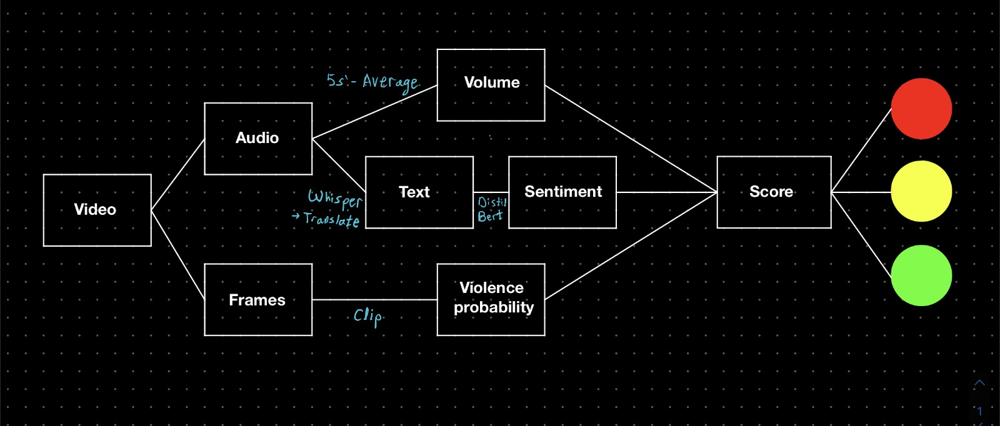
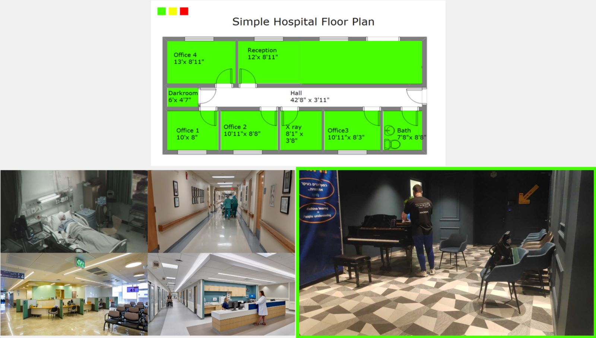

# CCTV Violence Detection System for Children's Hospitals

This project was done as part of the CS Hackathon 2023, which took place on 30-31/03/2023.  
The hackathon's aim was to improve the experience of hospital staff involved in the care of children and enhance the well-being of children and their families during their hospital stay.  
This project won the 1st place.

## Installation

1. Clone the repository:
```
git clone https://github.com/levyidan1/CCTV_Violence_Detection.git
```
2. Navigate to the project directory:
```
cd CCTV-Violence-Detection-System
```

3. Create a new conda environment and activate it:
```
conda create --name CCTV_Violence_Detection --file requirements.txt
conda activate CCTV_Violence_Detection
```
4. Insert the livestream URL (we used an android phone as a CCTV camera by using the IP Webcam app), your OpenAI organization key, and your API key in the relevant constants.

5. Change the constants in the beginning of the `main.py` file to change the behavior of the system.

6. Run the main.py python script:
```
python main.py
```


## Architecture



- A live stream is taken from a CCTV camera.
- The live stream is split into audio and video, and each is analyzed separately, producing a score.
- The individual scores are combined to produce a final score.

### Audio Analysis

- The audio analysis is done in a separate thread. It takes the audio from the livestream and saves it to a temporary file.
- The temporary file is then sent to the audio analysis function, which transcribes the audio, translates it to English, and analyzes the sentiment.
- If the sentiment is negative, an emotion classifier is used to determine the emotion (anger or fear) and the sentiment score is set to the maximum of the two.
- The sentiment score is then added to the average volume of the audio segment and a final score is calculated.

### Video Analysis

- The video analysis is done in a separate thread. It takes the video from the livestream and analyzes it every `FRAME_FREQUENCY` seconds.
- The video is analyzed using the CLIP model, which is a vision transformer model that takes as input an image and a list of text prompts, and outputs a probability for each prompt.
- The prompts used in this project are `'violent scene'`, `'non-violent scene'`.
- The probability of the `'violent scene'` prompt is multiplied by the `VIDEO_WEIGHT`.

### GUI


- The GUI is done using tkinter.
- The GUI displays the video from the livestream.
- If the final score is above `HIGH_PROB_THRESHOLD`, the background of the video is set to red.
- If the final score is above `MEDIUM_PROB_THRESHOLD`, the background of the video is set to yellow.
- If the final score is below `MEDIUM_PROB_THRESHOLD`, the background of the video is set to green.

## Authors

- Idan Levy
- Nadav Rubinstein
- Gil Litvin
- Edo Cohen
